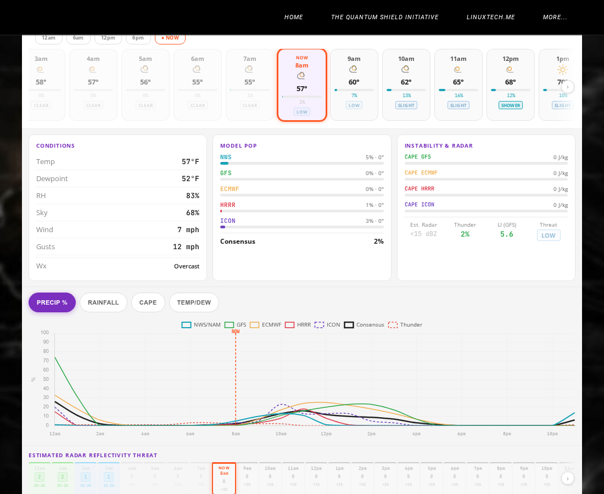

# Model Forecast Dashboard — Deep Dive

> **Live at:** [MebaneWeather.com](https://www.stewalexander.com/weather.html) · **File:** `mw-weebly-embed.html`



---

## What it is

The Model Forecast Dashboard is a self-contained hourly forecast widget built for [MebaneWeather.com](https://www.stewalexander.com/weather.html). It pulls live data from four weather model families, blends them into a consensus forecast, and presents a midnight-to-midnight hourly picture of the day — precipitation probability, rainfall, thunderstorm risk, temperature, dewpoint, CAPE, Lifted Index, and estimated radar reflectivity.

The entire thing is a single HTML file with no build step, no framework, no external runtime dependencies. Paste it into a Weebly Embed Code block and it works.

---

## What you see on screen

### 1. Header
The purple-to-blue gradient header shows the widget title, location (Mebane / Burlington NC), all-times-in-Eastern disclaimer, NWS model run age, and a pulsing green **LIVE** dot with the last-updated timestamp. A **STALE** badge appears automatically if data is more than 90 minutes old.

### 2. NWS Alert bar
A green / amber / red bar directly below the header. Pulls from the NWS Alerts API for zone NCZ023 in real time. Green = no active alerts; amber = watch/advisory; red = warning. Includes a direct link to weather.gov to verify.

### 3. SPC Severe Weather Risk bar
Shows today's Storm Prediction Center convective outlook risk level for Mebane's exact coordinates using **GeoJSON point-in-polygon** geometry — not HTML text parsing, which was previously reading Enhanced Risk text for Texas and applying it to North Carolina. Risk levels: NONE → MRGL → SLGT → ENH → MDT → HIGH, each with its official colour coding.

### 4. Day tabs
Seven scrollable tabs (Today through six days out). Switching tabs re-runs the full render pipeline for that day's data. Chevrons appear when tabs overflow the screen width.

### 5. Today at a Glance strip
A purple-bordered summary card showing the day's single most important numbers at a glance:

| Stat | What it shows |
|------|---------------|
| **TEMP** | Day's high (tap → jumps to warmest hour) / low (tap → jumps to coolest hour) |
| **DEW PT** | Day's highest dewpoint (muggiest hour) / lowest (driest hour) |
| **WIND** | Peak wind or gust speed for the day |
| **PRCP%** | Highest hourly precipitation probability |
| **RAIN** | Maximum hourly QPF (rainfall in inches) |
| **TSTM** | Peak thunderstorm probability |

Small SVG arrow and finger icons to the left of each value indicate it is tappable — no text labels needed. Tapping jumps the timeline slider and detail panel directly to that hour, and flashes the target hour card purple so you can see exactly which hour it landed on.

### 6. Timeline slider
A full-width range slider spanning midnight to midnight (00:00 → 23:59 Eastern). Dragging it updates the hour cards, detail panels, and chart simultaneously. Quick-jump buttons beneath it (12am · 6am · 12pm · 6pm · NOW) let you snap to common reference points. The **NOW** button always returns to today's tab regardless of which day tab is active, then scrolls to the current hour.

The orange ring, card highlight, and red dashed chart line mark the current moment. Past hours are dimmed at 50% opacity — you can't un-rain the morning.

### 7. Hour cards
A horizontally scrollable row of 24 hourly cards, midnight to midnight in US Eastern time. Each card shows:
- Local time label
- Weather icon (derived from sky cover %, thunder probability, and WMO weather code)
- Temperature in °F
- A colour-coded precipitation probability bar
- Percentage and threat badge (CLEAR / LOW / SLIGHT / SHOWER / RAIN / TSTM)

The currently selected card is highlighted purple. Thunderstorm cards get a red border. Chevron buttons appear at the edges when content overflows. Past cards are dimmed.

### 8. Conditions panel
The left detail panel for the selected hour: temperature, dewpoint, relative humidity, sky cover, wind speed, gusts, and a plain-English weather description.

### 9. Model POP panel
Shows individual model precipitation probabilities (NWS, GFS, ECMWF, HRRR, ICON) as labelled progress bars, plus the weighted Consensus value. QPF (rainfall amount) is shown alongside each. This panel makes model agreement and disagreement immediately visible — when all five bars line up, confidence is high; when they scatter, treat the forecast with more caution.

### 10. Instability & Radar panel
Shows CAPE (Convective Available Potential Energy) from each model, the estimated radar reflectivity level in dBZ, the GFS Lifted Index, and a plain-English threat classification (CLEAR / LOW / SLIGHT / SHOWER / RAIN / TSTM). High CAPE + negative LI + elevated thunder% = the atmosphere has fuel and a trigger.

### 11. Multi-model chart
A Chart.js line chart with four tabs: **Precip %**, **Rainfall**, **CAPE**, and **Temp/Dew**. All five model lines are shown simultaneously with the Consensus in black and Thunder % as a dashed overlay. The orange NOW line is drawn directly on the canvas via Chart.js's `afterDraw` plugin hook — no external annotation library needed. The chart updates instantly when you switch tabs or drag the slider.

### 12. Estimated Radar Reflectivity Threat row
A horizontally scrollable row of hourly cells colour-coded by estimated radar reflectivity (dBZ), derived from model QPF, CAPE, and thunder probability. The current hour cell has an orange ring and a "NOW" pip and is automatically scrolled into view on load. Past cells are dimmed. Each cell shows the dBZ range and a numeric CAPE value for storm-energy context.

### 13. How to Read This Dashboard (legend accordion)
A collapsible accordion at the very bottom explaining every element in plain language — written in the spirit of Richard Feynman explaining things to a curious, intelligent person who doesn't need to be talked down to. Sections: What you're seeing · The five weather computers · Storm energy indicators · Radar & threat colours · Severe weather risk (SPC). Single-column on narrow phones, expanding to 2 / 3 / 4 columns on wider screens.

### 14. Diagnostics panel
A collapsible `🔬 Diag` panel in the footer with colour-coded log lines showing boot state, fetch results, render steps, and any errors. Visible only when opened; designed to make on-device debugging possible without opening browser dev tools.

---

## Where the data comes from

| Source | What it provides | Weight in consensus |
|--------|-----------------|---------------------|
| **NWS RAH Gridpoints** (`api.weather.gov/gridpoints/RAH/49,69`) | Precipitation probability, QPF, thunderstorm %, sky cover, temperature, dewpoint, wind, gusts, RH | **40%** |
| **Open-Meteo (GFS)** | Precip probability, precipitation, CAPE, Lifted Index, weather code | **20%** |
| **Open-Meteo (ECMWF IFS)** | Precip probability, precipitation, CAPE | **25%** |
| **Open-Meteo (HRRR)** | Precip probability, precipitation, CAPE | **15%** |
| **Open-Meteo (ICON)** | Precip probability, precipitation, CAPE | Reference only — shown for spread awareness, not in consensus math |
| **NWS Alerts API** (`api.weather.gov/alerts/active?zone=NCZ023`) | Active watches, advisories, warnings | N/A |
| **SPC GeoJSON** (`spc.noaa.gov/products/outlook/day1otlk_cat.lyr.geojson`) | Convective outlook risk polygon | N/A |

The Open-Meteo models are fetched in a single batched request to minimise latency and API load.

**Consensus formula:**
```
Consensus PoP = (NWS × 0.40) + (ECMWF × 0.25) + (GFS × 0.20) + (HRRR × 0.15)
```

NWS carries the most weight because it reflects a Raleigh meteorologist's judgement applied to local terrain — not just raw model output.

---

## How times work

Everything is displayed in **US Eastern time, DST-aware**. Zero Zulu/UTC labels appear anywhere in the UI. The UTC offset is computed once at boot using the `Intl` API (`America/New_York`) and stored as `ET_OFF` (e.g. `-240` minutes for EDT). All UTC-to-local conversions go through this offset.

The hour cards and chart are ordered **local midnight → local midnight**, not UTC midnight → UTC midnight. This required a `localOrderedUTCHours()` remapping function that reorders the records array (which is indexed by UTC hour 0–23) into the correct local display order. The tap-to-jump feature uses this same remapping to find the correct slot for each peak value — an easy bug to introduce if you index by UTC position directly.

---

## How the code is structured

The widget is a single HTML file, roughly 2,100 lines, organised in these sections:

```
<style>          CSS — all scoped under #mwdb to avoid leaking into the host page
<div id="mwdb">  HTML skeleton — header, alert bars, tabs, strip placeholder, timeline, detail, chart, radar, legend
<script>         All logic — no imports, no modules, just vanilla JS

JavaScript sections (in order):
  Constants & state (S object)
  ET offset computation
  omV()           UTC hour → Open-Meteo array index lookup
  compile()       Assembles one day's 24 records from all model sources
  Fetch layer     safeFetch(), fetchAll() — all network calls with timeouts + cache-busting
  Render layer    renderDay() → renderTL + renderDetail + renderRadar + renderChart + renderSummary
  UI helpers      selectH(), jumpCards(), jumpNow(), jumpToStat(), scrollRow(), updateScrollHints()
  Boot            IntersectionObserver — widget only activates when scrolled into view
```

### Key design decisions

**`safeFetch()`** — every network call goes through this wrapper. It never throws; it resolves `null` on any failure (timeout, CORS error, HTTP error, parse error). The render layer handles null gracefully. This is what makes the widget failure-resistant when one API is down.

**`unpackOM()`** — Open-Meteo returns all five model responses in one batched JSON object. This function extracts the hourly arrays for a named model (e.g. `'gfs_global'`) into a keyed map of `"YYYY-MM-DDThh:00" → value` for fast lookup during compile.

**`compile(dateStr)`** — builds an array of 24 record objects for one day, one per UTC hour, by joining NWS grid data, NWS hourly forecast data, and Open-Meteo model data. Each record contains ~25 fields used downstream by all render functions.

**`S.days[]` upsert** — when new data arrives (on refresh or day-tab switch), records are upserted into `S.days` keyed by date string. This prevents duplicate data accumulation across hourly refreshes.

**`localOrderedUTCHours()`** — returns an array of UTC hours reordered so index 0 = local midnight. e.g. at EDT (UTC-4): `[4,5,6,...,23,0,1,2,3]`. Used by `slotToRec()` to map display slot → correct record, and by `peakSlot()` / `minSlot()` in `renderSummary()` to find peak-value hours in local display order.

**IntersectionObserver boot** — the widget is completely inert until it scrolls into the viewport. This prevents it from blocking page load or interfering with other Weebly widgets. A `_booted` guard ensures `init()` runs exactly once.

**Chart.js `afterDraw` hook** — the orange NOW line on the chart is drawn directly on the canvas in the `afterDraw` callback rather than using the `chartjs-plugin-annotation` library. This removes an external dependency and eliminates the version-mismatch failures that killed earlier versions of the chart.

**SPC point-in-polygon** — the SPC Day 1 outlook is a GeoJSON FeatureCollection of risk polygons. The widget uses a ray-casting algorithm to test whether Mebane's coordinates (36.1°N, 79.3°W) fall inside any polygon. The previous implementation used HTML text search on the SPC outlook page, which incorrectly matched "Enhanced Risk" text referring to Texas.

---

## Resilience checklist

| Concern | How it's handled |
|---------|-----------------|
| API timeout | `safeFetch()` with 8–15s per-endpoint AbortController timeout |
| Stale data | `cache:'no-store'` + `_t=` timestamp query param on all Open-Meteo URLs |
| Old service worker | Detected and unregistered on boot to clear previous caching layers |
| `file://` protocol | Detected at boot; shows a clear message instead of silent failure |
| Render errors | `renderDay()` wraps each sub-function in individual try/catch so a chart failure can't prevent the summary strip from rendering |
| Weebly CSS interference | CSS class toggling (`classList.remove('mw2-hidden')`) rather than inline `style=` which Weebly strips |
| Non-blocking load | IntersectionObserver delays all work until widget is in viewport |
| Hourly refresh | NWS model-window-aware scheduler triggers refresh when new model data is expected, even if the page hasn't been reloaded |

---

## Adapting for your location

1. Find your NWS gridpoint at `https://api.weather.gov/points/{lat},{lon}`
2. Replace the three NWS URLs near the top of the `<script>` block (gridpoints, hourly, alerts zone)
3. Update the `LAT` / `LON` constants used for SPC point-in-polygon
4. Update the location display name in the header HTML
5. Paste into your Weebly Embed Code block and publish

---

_Part of the [MebaneWeather.com](https://www.stewalexander.com/weather.html) open-source weather monitoring suite — built for Mebane, NC, adaptable anywhere in the US._
