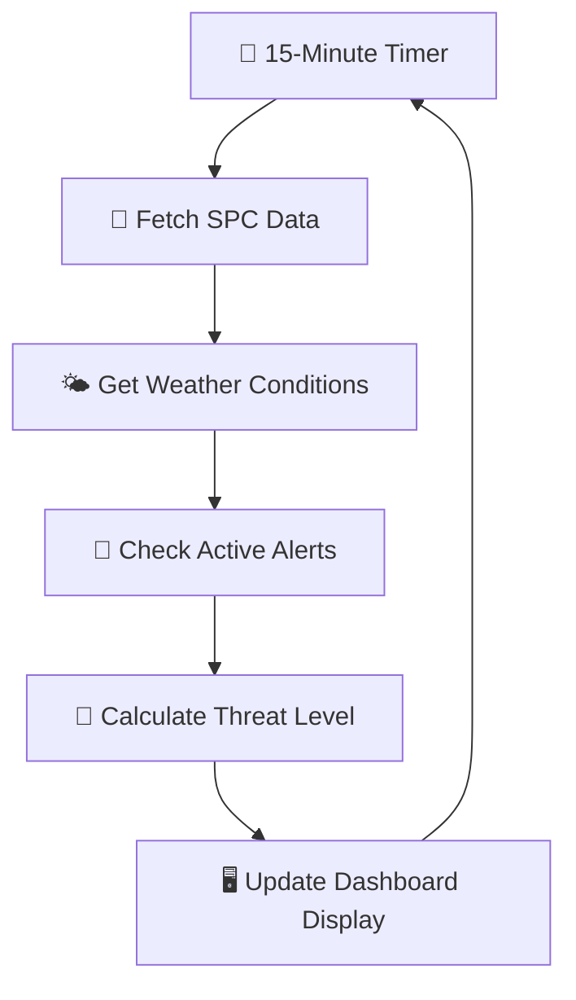

# 🌩️ MebaneWeather.com - Enhanced Severe Weather Dashboard

> 🏠 **Live at:** [MebaneWeather.com](https://www.stewalexander.com/weather.html) - Your trusted source for Mebane, NC weather monitoring!

[](https://www.weebly.com/)
[](https://www.noaa.gov/)
[](https://www.spc.noaa.gov/)
[](https://github.com/StewAlexander-com/mebane-weather-dashboard)

## 🎯 Project Overview

**MebaneWeather.com** features a sophisticated, real-time severe weather monitoring dashboard specifically designed for Mebane, North Carolina (Alamance County). This dashboard integrates official NOAA Storm Prediction Center (SPC) threat assessments with local weather conditions to provide residents with accurate, up-to-date severe weather information.

### 🚀 Key Features

| Feature | Description | Status |
|---------|-------------|--------|
| ⚡ **SPC Threat Integration** | Real-time Storm Prediction Center risk levels | ✅ Active |
| 🎯 **Location-Specific** | Precision targeting for Mebane, NC (36.096°N, 79.267°W) | ✅ Active |
| 📱 **Mobile Responsive** | Optimized for all device sizes | ✅ Active |
| 🔄 **Auto-Refresh** | Updates every 15 minutes | ✅ Active |
| 🖱️ **Interactive Panels** | Clickable sections linking to official sources | ✅ Active |
| 🌐 **Weebly Optimized** | Self-contained HTML for easy Weebly integration | ✅ Active |

## 🌟 What Makes This Special

### 🎯 **Hyper-Local Accuracy**
- **Geographic Precision**: Uses exact Mebane, NC coordinates for SPC threat detection
- **Official Sources**: Integrates directly with NOAA/SPC MapServer APIs
- **Real-time Updates**: Continuously monitors changing weather conditions

### 🛡️ **Smart Threat Assessment**
The dashboard uses a sophisticated three-tier threat classification system:

| Threat Level | Icon | Color | Description |
|--------------|------|-------|-------------|
| **SAFE** | ✅ | 🟢 Green | No severe weather expected |
| **MONITOR** | 👁️ | 🟡 Yellow | Conditions developing - stay alert |
| **WARNING** | ⚠️ | 🔴 Red | Active severe weather - take action |

### 📊 **SPC Risk Categories**
Displays all official Storm Prediction Center threat levels:

- 🌩️ **TSTM**: General Thunderstorms, No Severe Weather Expected
- 🟡 **MRGL**: Marginal Risk - Isolated severe storms possible
- 🟠 **SLGT**: Slight Risk - Scattered severe storms likely
- 🔴 **ENH**: Enhanced Risk - Numerous severe storms expected
- 🔴 **MDT**: Moderate Risk - Widespread severe storms likely
- ⚫ **HIGH**: High Risk - Major severe weather outbreak expected

## 🔧 Technical Architecture

### 🌐 **API Integrations**

#### Primary Data Sources
1. **🎯 SPC GIS MapServer** - Official storm threat polygons
   - Endpoint: `https://mapservices.weather.noaa.gov/vector/rest/services/outlooks/SPC_wx_outlks/MapServer/1/query`
   - Method: Point-in-polygon spatial analysis
   - Update Frequency: Every 15 minutes

2. **🌤️ Open-Meteo Weather API** - Current conditions
   - Real-time temperature, wind speed, precipitation
   - Weather code classification for severe weather detection

3. **📢 NWS Alamance County Alerts** - Local warnings/watches
   - Zone: NCZ023 (Alamance County)
   - Active alert monitoring and display

4. **📝 NWS Forecast Discussion** - Meteorologist insights
   - Area Forecast Discussion (AFD) from NWS Raleigh
   - Keyword extraction for severe weather highlights

### 🏗️ **Code Structure**

```
📁 Project Structure
├── 🎨 CSS Styles (Inline)
│   ├── Dark theme styling
│   ├── Responsive breakpoints
│   └── Interactive hover effects
├── 🖼️ HTML Structure
│   ├── Two-panel grid layout
│   ├── Threat level display panel
│   └── Alerts & forecast panel
└── 🧠 JavaScript Logic
    ├── SPC API integration
    ├── Weather data processing
    ├── Threat level calculation
    └── Auto-refresh mechanisms
```

### 🔄 **Update Cycle**



## 🚀 Installation Guide

### 🌐 **For Weebly Sites**

1. **📝 Access Weebly Editor**
   - Log into your Weebly account
   - Navigate to your site editor

2. **➕ Add Custom HTML Element**
   - Drag "Embed Code" element to your page
   - Select "Edit Custom HTML"

3. **📋 Copy & Paste Code**
   - Copy entire code from `06-11-04.txt`
   - Paste into the Custom HTML box
   - Click "Update"

4. **✅ Publish & Test**
   - Click "Publish" to make changes live
   - Verify dashboard loads and updates properly

### 🖥️ **For Other Platforms**

The code is self-contained HTML and can be embedded in:
- WordPress (HTML widget)
- Squarespace (Code block)
- Wix (HTML iframe)
- Static HTML sites

## 🛠️ Configuration

### 📍 **Location Customization**

To adapt for different locations, modify the coordinates in the JavaScript:

```javascript
// Configuration for Mebane, NC
const coords = { lat: 36.096, lng: -79.267 };
```

### ⏱️ **Update Frequency**

Adjust the refresh interval (default: 15 minutes):

```javascript
const updateInterval = 900000; // 15 minutes in milliseconds
```

### 🎨 **Visual Customization**

The dashboard uses CSS custom properties for easy theming:
- Background colors: `#1a1a1a` (main), `#2d2d2d` (panels), `#373737` (sections)
- Accent colors: `#4fc3f7` (primary), `#ff7043` (secondary)
- Text colors: `#e0e0e0` (main text), various for status indicators

## 🔍 Troubleshooting

### ⚠️ **Common Issues**

#### "SPC: Data temporarily unavailable"
- **Cause**: API endpoint temporarily down or CORS restrictions
- **Solution**: Wait 15 minutes for automatic retry, or check browser console for specific errors

#### "Loading threat assessment..." persists
- **Cause**: JavaScript initialization failure
- **Solution**: 
  1. Check browser console for errors
  2. Ensure code is properly embedded
  3. Verify no conflicting JavaScript on page

#### Dashboard not responsive on mobile
- **Cause**: Weebly CSS conflicts
- **Solution**: The code includes `!important` declarations to override platform styles

### 🐛 **Debug Mode**

Enable debug logging by opening browser Developer Tools (F12) and checking the Console tab. The dashboard logs:
- SPC risk level detection results
- API response status
- Update cycle information

## 🌐 Browser Compatibility

| Browser | Desktop | Mobile | Notes |
|---------|---------|--------|-------|
| Chrome | ✅ | ✅ | Full support |
| Firefox | ✅ | ✅ | Full support |
| Safari | ✅ | ✅ | Full support |
| Edge | ✅ | ✅ | Full support |
| IE 11 | ❌ | ❌ | Not supported (uses modern JavaScript) |

## 🤝 Contributing

### 🧪 **Development Setup**

1. Fork this repository
2. Make changes to the HTML/CSS/JavaScript
3. Test thoroughly with different weather conditions
4. Submit pull request with detailed description

### 📋 **Contribution Guidelines**

- **🎯 Focus**: Maintain accuracy of weather data
- **🎨 Design**: Preserve responsive, accessible design
- **⚡ Performance**: Keep code lightweight and fast
- **🧹 Code Quality**: Follow existing patterns and comment new features

### 🚀 **Feature Requests**

Have ideas for improvements? Open an issue with:
- 📝 Clear description of the requested feature
- 🎯 Use case explanation
- 💡 Implementation suggestions (if applicable)

## 📜 License

This project is licensed under the MIT License - see the [LICENSE](LICENSE) file for details.

## 🙏 Acknowledgments

- **🏛️ NOAA/National Weather Service** - Official weather data and alerts
- **🌩️ Storm Prediction Center** - Severe weather threat assessments
- **🌐 Open-Meteo** - Real-time weather API
- **🏗️ Weebly Platform** - Hosting and integration support

## 📊 Project Stats

- **📅 Created**: June 2025
- **🔄 Last Updated**: June 11, 2025
- **📍 Target Location**: Mebane, NC (Alamance County)
- **👨‍💻 Maintainer**: [@StewAlexander-com](https://github.com/StewAlexander-com)
- **🌐 Live Site**: [MebaneWeather.com](https://www.stewalexander.com/weather.html)

## 🚨 Emergency Weather Information

**⚠️ IMPORTANT**: This dashboard is for informational purposes only. For official weather warnings and emergency information, always consult:

- 🏛️ **National Weather Service**: [weather.gov](https://weather.gov)
- 📻 **Emergency Alert System**: Monitor local radio/TV
- 📱 **Wireless Emergency Alerts**: Keep mobile alerts enabled
- 🆘 **Local Emergency Management**: Follow Alamance County emergency protocols

---

### 🏠 Visit MebaneWeather.com Today!

Experience the dashboard live at **[MebaneWeather.com](https://www.stewalexander.com/weather.html)** - your trusted source for Mebane, NC severe weather monitoring!

*Built with ❤️ for the Mebane, NC community*
