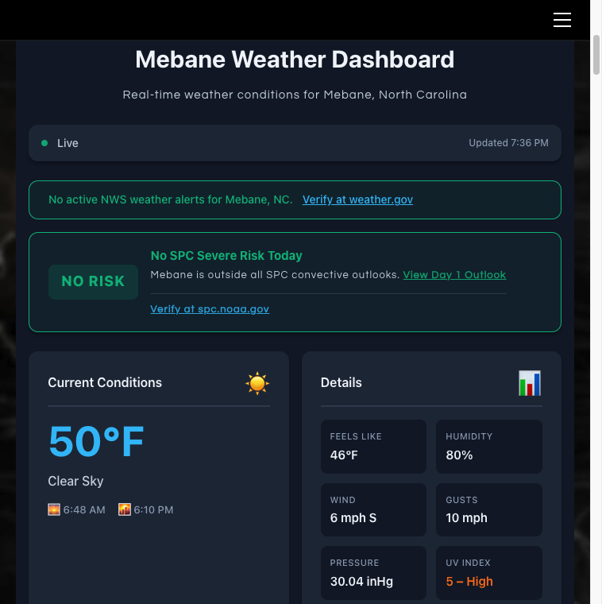

# 🌩️ MebaneWeather.com - Enhanced Severe Weather Dashboard

MebaneWeather.com is a self-contained severe weather dashboard and forecast widget designed for easy embedding (Weebly, WordPress, static HTML) with real-time SPC, NWS, and radar integration for Mebane, NC. You can also adapt it to any U.S. location with a few configuration changes.

> 🏠 **Live at:** [MebaneWeather.com](https://www.stewalexander.com/weather.html) — Your trusted source for Mebane, NC weather monitoring!

[](https://www.weebly.com/)
[](https://www.noaa.gov/)
[](https://www.spc.noaa.gov/)
[](https://github.com/StewAlexander-com/mebane-weather-dashboard)

## 🎯 Project Overview

**MebaneWeather.com** provides real-time weather and severe-weather monitoring for Mebane, NC (Alamance County). The repo includes three embeddable components:

| Component | File | Description |
|-----------|------|-------------|
| **Severe Weather Dashboard** | `Severe-Weather-Dashboard.html` | SPC threat levels, NWS alerts, summarized NWS AFD, winter weather detection |
| **Forecast Widget** | `MebaneWeather Forecast.css` | Current conditions (Open‑Meteo + NWS AFD), 7‑day forecast, NWS alerts, SPC Day 1; resilient with caching and retries; "From the NWS:" link to full AFD |
| **Live Radar Map** | `LiveRadarMap.css` | RainViewer precipitation radar (past + nowcast) with Play/Pause and speed control; fullscreen on desktop and smartphones (CSS fallback on iOS); resilient with caching and a 7‑minute watchdog when the tab is visible |

All three are self-contained HTML for Weebly Embed Code (or any platform that accepts embedded HTML).

**Preview:** Screenshot of the live dashboard at [MebaneWeather.com](https://www.stewalexander.com/weather.html):



### 🚀 Key Features

| Feature | Description | Status |
|---------|-------------|--------|
| ⚡ **SPC Threat Integration** | Real-time Storm Prediction Center risk levels | ✅ Active |
| 🎯 **Location-Specific** | Mebane, NC (36.096°N, -79.267°W); configurable for other locations | ✅ Active |
| 📱 **Mobile Responsive** | Optimized for all device sizes | ✅ Active |
| 🔄 **Auto-Refresh** | Severe dashboard: 15‑minute refresh plus 3‑minute alert polling. Forecast: 4‑minute weather refresh, 3‑minute alerts/SPC; skips redundant fetches to reduce API load. | ✅ Active |
| 🖱️ **Interactive Panels** | Clickable sections linking to NWS/SPC sources | ✅ Active |
| 📝 **AFD Summarization** | Severe: bullet highlights. Forecast: one-sentence NWS AFD in Current Conditions with "From the NWS:" link | ✅ Active |
| ❄️ **Winter Weather Detection** | Severe dashboard: NWS alerts + AFD text | ✅ Active |
| 🌐 **Weebly Optimized** | Self-contained HTML for Embed Code | ✅ Active |
| 📶 **Resilience (Forecast)** | Exponential backoff with jitter, cache fallback, and offline handling. Per‑attempt timeouts grow over retries for more robust behavior. | ✅ Active |
| 📋 **Audit Trail (Forecast)** | Footer shows data sources; status bar distinguishes Live vs Cached (with age); includes links to verify at the original source. | ✅ Active |
| 🗺️ **Live Radar (RainViewer)** | Past + nowcast frames, latest on load; zoom/pan reloads tiles; fullscreen on desktop and smartphones (CSS fallback on iOS); 7‑minute watchdog when tab visible. | ✅ Active |

### 📅 Recent Updates

**March 2025** – Live Radar Map (`LiveRadarMap.css`):
- **Radar behavior:** Uses the RainViewer API for past and nowcast frames and always shows the latest observation on load and after refresh. Zoom or pan reloads tiles so the radar fills the new view without extra clicks.
- **Fullscreen:** Desktop uses the Fullscreen API; iPhone/iPad use a CSS-based fullscreen layout with safe-area insets. In fullscreen, a Play/Pause button appears above "Exit full screen" so animation works without leaving fullscreen.
- **Failover:** When RainViewer is slow or unavailable and no cached frames exist, the map automatically falls back to a CONUS NWS/NOAA radar overlay and returns to RainViewer when it recovers. At zoom 8+ the map uses NWS radar to avoid "Zoom level not supported"; tile errors also trigger NWS fallback. Zooming or panning tries RainViewer again.
- **Watchdog & animation:** A 7‑minute watchdog refreshes frames while the tab is visible, only updating when newer data exists. Play/Pause, Previous/Next, and a speed slider control animation for both RainViewer and NWS frames (NWS: last 2 hours at 10‑minute steps, with cached frame times for responsive play).
- Detailed failure modes, backoff, and cache behavior are documented in [RESILIENCE_AND_ACCURACY_ASSESSMENT.md](RESILIENCE_AND_ACCURACY_ASSESSMENT.md) (when present).

**February 2025** – Forecast widget (`MebaneWeather Forecast.css`):
- Open‑Meteo + NWS alerts + SPC Day 1 outlook; cards link to NWS/SPC for verification.
- Current Conditions: Meteo line (temp, condition, feels like, wind) plus optional one-sentence NWS AFD summary; "From the NWS:" links to the full Area Forecast Discussion. Summary is trimmed for readability (no trailing "and", "to", "or", or lone adjectives).
- Caching and retries: exponential backoff with jitter for weather, NWS, SPC, and AFD; sessionStorage cache (weather 2 h, NWS 10 min, SPC 30 min, AFD 30 min); offline detection and refresh on reconnect. UI paints immediately, then enhances when AFD is ready.
- Status bar: “Live” only when live; “Cached data” + “X min ago” when showing cache; no stale “Updated” when cached
- Single footer audit trail.

**December 2024** – Severe dashboard: winter weather advisory logic fixed (advisories only from NWS alerts API).

## 📑 Table of Contents

- [🌩️ MebaneWeather.com - Enhanced Severe Weather Dashboard](#️-mebaneweathercom---enhanced-severe-weather-dashboard)
  - [🎯 Project Overview](#-project-overview)
    - [🚀 Key Features](#-key-features)
  - [📑 Table of Contents](#-table-of-contents)
  - [🛡️ Smart Threat Assessment](#️-smart-threat-assessment)
  - [🔧 Technical Architecture](#-technical-architecture)
  - [🚀 Installation \& Configuration](#-installation--configuration)
    - [Quick Install (Weebly)](#quick-install-weebly)
    - [Customization](#customization)
      - [Changing Location](#changing-location)
      - [Forecast widget: use for your location](#forecast-widget-use-for-your-location)
  - [🔍 Troubleshooting](#-troubleshooting)
    - [Common Issues](#common-issues)
  - [🧪 Testing](#-testing)
  - [🌐 Browser Compatibility](#-browser-compatibility)
  - [📝 Code Documentation](#-code-documentation)
  - [🤝 Contributing](#-contributing)
  - [📜 License \& Project Info](#-license--project-info)
  - [🚨 Emergency Weather Information](#-emergency-weather-information)

## 🛡️ Smart Threat Assessment

The dashboard uses a four-tier threat classification system with priority-based evaluation:

| Threat Level | Icon | Color | Description | Trigger |
|--------------|------|-------|-------------|---------|
| **WARNING** | ⚠️ | 🔴 Red | Active weather warnings in effect | Active NWS warnings (includes winter weather warnings) |
| **CAUTION** | ⚡ | 🟠 Orange | Elevated severe weather risk | SPC Enhanced/Moderate/High risk |
| **MONITOR** | ❄️/□ | 🟡 Yellow | Monitor conditions for development | Winter weather advisories, SPC Marginal/Slight risk |
| **SAFE** | ✅ | 🟢 Green | No severe weather expected | No warnings, no SPC risk |

**Priority order:** Warnings first, then winter weather advisories (MONITOR), then higher SPC risks (CAUTION), then lower SPC risks (MONITOR).

**Winter weather:** Detects NWS winter alerts and conditions. "Winter Precipitation Imminent and/or Occurring" shows for active warnings; "Monitor for Winter Conditions" only appears when there is an active winter weather advisory from the NWS alerts API.

**SPC Risk Categories**: TSTM, MRGL, SLGT, ENH, MDT, HIGH - Maps official Storm Prediction Center outlook levels with intelligent forecast discussion summarization.

## 🔧 Technical Architecture

### Severe Weather Dashboard

**API Integrations:** SPC GIS MapServer (point-in-polygon); NWS Alerts API (zone NCZ023 + statewide fallback); NWS Forecast Discussion (RAH, AFD summarization).

**Update cycle:** Full refresh 15 min (`updateInterval` 900000); alert polling 3 min (180000); visibility refresh on tab focus.

**Data flow:** Initialize → SPC Risk Check → Alert Processing → Threat Calculation → AFD Processing → UI Update.

### Forecast Widget

**Data sources:** Open-Meteo API (current + 7-day); NWS alerts by point (`LAT`,`LON`); SPC Day 1 outlook (GeoJSON, point-in-polygon); NWS AFD (Raleigh/RAH) for Current Conditions sentence.

**Current Conditions card:** Meteo line (temp, condition, feels like, wind); line break; optional "From the NWS:" (link to AFD) + one-sentence AFD summary (smaller font). Summary is trimmed so it never ends in "and", "to", "or", or lone adjectives. AFD is best-effort (cache 30 min, retries with exponential backoff); UI paints immediately, then enhances when AFD is ready.

**Update cycle:** Main weather 4 min (`REFRESH` 240000); NWS/SPC 3 min (`ALERTS_REFRESH_MS` 180000). No new fetch if one started in the last 1.5 min (weather: when cache exists; alerts: always). Visibility and `online` trigger refresh.

**Resilience:** sessionStorage cache (weather 2 h, NWS 10 min, SPC 30 min, AFD 30 min); retries with exponential backoff + jitter for weather, NWS, SPC, and AFD; per-attempt timeout growth (10s → 25s cap); offline skip + refresh on `online`; in-flight guard.

### Live Radar Map

**Data source:** RainViewer public API (`api.rainviewer.com/public/weather-maps.json`) — past and nowcast precipitation frames.

**Behavior:** Displays the **latest observation** (last past frame) on load. Play/Pause animates through past + nowcast (RainViewer) or, when NWS is active (zoom 8+, fallback, or tile-error), through NWS frames (last 2 h at 10‑min steps; cached frame times for responsive play). Previous/Next step one frame; speed slider controls ms per frame. In **fullscreen**, a Play/Pause button appears (stacked above Exit full screen, left-aligned) so animation works without leaving fullscreen; layout avoids overlap and keeps Leaflet attribution visible. At zoom 8+ the map uses NWS only to avoid "Zoom level not supported"; RainViewer tile errors trigger automatic failover to NWS. On zoom or pan, the current radar layer is synced so tiles load for the new view. Preload warms the first 12 RainViewer frame layers without removing the displayed frame.

**Update cycle:** Full refresh every 10 min (`REFRESH`). When the tab is **visible**, a 7‑min **watchdog** runs a background fetch and updates the map only if the API has a newer latest frame; when the tab is hidden, the watchdog is cleared. Min 90 s between fetches when cache exists.

**Resilience:** sessionStorage cache (10 min TTL); fetch with AbortController timeout (10 s, up to 25 s on retries); 3 retries with exponential backoff + jitter; in-flight guard; offline → use cache or show message; Live vs “Cached (X min ago)” in timestamp; Retry button; `online` listener. NWS: frame-time cache (10 min) for play; WMS TIME animation with setParams/redraw; try/catch in NWS tick. RainViewer tile-error watch (2 errors in 2 s) → NWS failover; zoom/pan clears tile_error for retry. Play/animation: guards (map, frames or NWS frames), single timer, try/catch in `showFrame` and tick; only frames with valid `path`; preload skips removing the currently displayed layer.

## 🚀 Installation & Configuration

### Quick Install (Weebly)

**Severe Weather Dashboard:** Copy all of `Severe-Weather-Dashboard.html` into an Embed Code element → Publish.

**Forecast Widget:** Copy all of `MebaneWeather Forecast.css` into an Embed Code element → Publish. (File is HTML + CSS + JS; no `.css` build step.)

**Live Radar Map:** Copy all of `LiveRadarMap.css` into an Embed Code element → Publish. (File is HTML + CSS + JS; no build step. Requires Leaflet from unpkg in the embed.)

**Other platforms:** Use an HTML/embed block (WordPress, Squarespace, Wix, static HTML, GitHub Pages).

### Customization

#### Changing Location

To customize the dashboard for a different location, modify the `LOCATION_CONFIG` object in the JavaScript section:

1. **Open** `Severe-Weather-Dashboard.html` and find the `LOCATION_CONFIG` section (near the top of the JavaScript code)

2. **Update all values** in the configuration object:

```javascript
const LOCATION_CONFIG = {
  coords: { lat: 36.096, lng: -79.267 },  // Your location coordinates
  nwsZone: 'NCZ023',                       // Your NWS zone code
  stateCode: 'NC',                         // Your state code
  nwsOffice: 'RAH',                        // Your NWS office identifier
  locationName: 'Mebane, NC'               // Display name
};
```

**Finding Your Location Values:**

- **Coordinates** (lat/lng): Use [Google Maps](https://www.google.com/maps) - right-click your location → coordinates
- **NWS Zone Code**: Visit [forecast.weather.gov](https://forecast.weather.gov/MapClick.php) → click your location → check the URL for `zoneid=` (format: STATEZONENUMBER, e.g., `TXZ123`, `CAZ045`)
- **State Code**: Two-letter state abbreviation (e.g., `TX`, `CA`, `FL`, `NY`)
- **NWS Office**: Find your office at [weather.gov/organization](https://www.weather.gov/organization.php) (e.g., `OUN` for Norman, OK; `SFO` for San Francisco, CA)
- **Location Name**: Any display name you prefer

**Example for Oklahoma City, OK:** Use `coords`, `nwsZone`, `stateCode`, `nwsOffice`, `locationName` as in the example in the file.

#### Forecast widget: use for your location

1. Open `MebaneWeather Forecast.css` and find the script constants (near the top of the `<script>` block).
2. Set coordinates and NWS/SPC URLs for your location:

| Variable | Meaning | Example (Mebane) |
|----------|---------|------------------|
| `LAT` | Latitude | `36.0957` |
| `LON` | Longitude | `-79.2670` |
| `NWS_FORECAST_URL` | NWS point forecast (temp, 7-day, alerts) | `https://forecast.weather.gov/MapClick.php?lat=36.0957&lon=-79.2670` |
| `SPC_OUTLOOK_URL` | SPC Day 1 convective outlook | `https://www.spc.noaa.gov/products/outlook/day1otlk.html` (same for all US) |
| `NWS_OFFICE` | NWS office for AFD (Current Conditions sentence and "From the NWS:" link) | `'RAH'` (Raleigh); find yours at [weather.gov/organization](https://www.weather.gov/organization.php) |

3. Build your NWS URL: visit [forecast.weather.gov/MapClick.php](https://forecast.weather.gov/MapClick.php), click your location, then copy the URL containing `lat=` and `lon=`.
4. Replace the footer links: in the static HTML footer, search for `lat=36.0957` and `lon=-79.2670` and replace with your coordinates in both NWS href URLs.
5. Save and paste the full file into your Embed Code element.

Alerts and SPC are fetched by point (`LAT`,`LON`). Set `NWS_OFFICE` so the AFD summary and "From the NWS:" link use your area's forecast discussion.

**Other Customizations:**

- **Severe dashboard**: `updateInterval` = 900000 (15 min), alert polling = 180000 (3 min). Visual styling: inline CSS in the file (e.g. `#1a1a1a`, `#4fc3f7`). Advanced: `updateLocalAlertsAndGetStatus()`, `updateForecastDiscussion()`.
- **Forecast widget**: In the script, `REFRESH` = 240000 (4 min main weather), `ALERTS_REFRESH_MS` = 180000 (3 min NWS/SPC). `MIN_WEATHER_INTERVAL_MS` / `MIN_ALERTS_INTERVAL_MS` = 90000 (1.5 min) prevent starting a new fetch too soon after the last one to stay within API tolerance and reduce duplicate lookups. Timeouts: `TIMEOUT` = 10000, `TIMEOUT_MAX_MS` = 25000. Cache TTLs: `CACHE_TTL` = 7200000 (2 h), `NWS_CACHE_TTL` = 600000 (10 min), `SPC_CACHE_TTL` = 1800000 (30 min), `AFD_CACHE_TTL` = 1800000 (30 min). AFD: `NWS_OFFICE` = 'RAH' (change for other locations); `NWS_AFD_URL` is derived; AFD retries use exponential backoff (`AFD_BACKOFF_BASE_MS`, `AFD_BACKOFF_MAX_MS`).

## 🔍 Troubleshooting

### Common Issues

| Issue | Solution |
|-------|----------|
| "SPC: Data temporarily unavailable" (Severe) | Wait 15 min; dashboard defaults to SAFE. Check console. |
| "Loading threat assessment..." persists (Severe) | Check console (F12), embedding, browser. |
| "Alert system temporarily unavailable" (Severe) | Zone → statewide fallback; check network. |
| Forecast shows "Cached data" (Forecast) | Live fetch failed; data from sessionStorage. NWS/SPC still refresh every 3 min. Retry or check network. |
| Not responsive on mobile | Check responsive breakpoints; both components use mobile overrides. |
| Alerts not updating quickly | Severe: 3 min polling (180000). Forecast: 3 min (ALERTS_REFRESH_MS 180000); minimum 1.5 min between alert fetch starts. |
| "No significant weather" in AFD (Severe) | API then HTML fallback; scoring needs specific keywords. Check console. |

### Error Handling & Resilience

**Severe Weather Dashboard:** Timeouts 8–10 s; alerts zone → statewide fallback; AFD API → HTML fallback; SPC defaults to SAFE if unavailable; each source independent; response validation.

**Forecast Widget:** Timeouts 10 s first attempt, up to 25 s on retries (`retryTimeout`); weather/NWS/SPC each have 3 retries, AFD 2 retries, all with exponential backoff + jitter; cache fallback (weather 2 h, NWS 10 min, SPC 30 min, AFD 30 min); offline detection skips fetch and refreshes on `online`; in-flight guard; AFD never blocks paint (4 s UI timeout, then enhance when ready).

**Debug:** F12 → Console. Verify: fetch to `api.open-meteo.com`, `api.weather.gov`, `spc.noaa.gov`; threat level vs [SPC outlook](https://www.spc.noaa.gov/products/outlook/).

## 🧪 Testing

**Quick Start:**
```bash
./run-tests.sh  # or: python3 run_tests.py
```

**Test Coverage**: Severe Weather Dashboard — SPC mapping, threat levels, alert processing, winter weather detection, error handling. Forecast widget — backoff and retry timeout logic (resilience).

**Test Files**: `run_tests.py` (Python), `run-tests.sh` (shell wrapper), `test-dashboard.html` (browser UI for Severe dashboard).

**Approach**: Logic and resilience tests; no live API calls. Run `python3 run_tests.py` for full suite; open `test-dashboard.html` for in-browser Severe dashboard checks.

## 🌐 Browser Compatibility

**Supported:** Chrome, Firefox, Safari (iOS 12+), Edge — full desktop and mobile support.

**Not supported:** IE 11 (requires ES6+, Fetch API, CSS Grid, AbortController).

## 📝 Code Documentation

Comprehensive inline documentation in docstring style: File headers, JSDoc-style function docs, section comments, and inline explanations covering threat level hierarchy, alert filtering, AFD processing, polling intervals, and error handling.

## 🤝 Contributing

**Development**: Fork → Clone → Make changes → Test thoroughly → Submit PR with detailed description

**Guidelines**: Maintain weather data accuracy, preserve responsive design, keep code lightweight, follow documentation style, include error handling, test on multiple browsers/devices.

**Feature Requests**: Open issue with clear description, use case, implementation suggestions, and impact assessment.

**Bug Reports**: Include browser/version, steps to reproduce, expected vs actual behavior, console errors, and screenshots.

## 📜 License & Project Info

**License**: MIT License - see [LICENSE](LICENSE) file for details

**Project Stats**: Created June 2025 • Last Updated March 2025 • Location: Mebane, NC (Alamance County, Zone NCZ023) • NWS Office: Raleigh, NC (RAH) • Maintainer: [@StewAlexander-com](https://github.com/StewAlexander-com)

**Acknowledgments**: NOAA/National Weather Service, Storm Prediction Center, Weebly Platform

**Live Site**: [MebaneWeather.com](https://www.stewalexander.com/weather.html)

## 🚨 Emergency Weather Information

**⚠️ IMPORTANT:** This dashboard is for informational purposes only. For official warnings and emergency information, consult: [National Weather Service](https://weather.gov), Emergency Alert System (local radio/TV), Wireless Emergency Alerts, Local Emergency Management, [Storm Prediction Center](https://www.spc.noaa.gov).

**In case of severe weather:** Follow local authority instructions, seek immediate shelter if warnings are issued, monitor multiple sources, and have an emergency plan ready.

---

*Built with ❤️ for the Mebane, NC community — and easily adapted to your location.*