# 🌩️ MebaneWeather.com - Enhanced Severe Weather Dashboard

> 🏠 **Live at:** [MebaneWeather.com](https://www.stewalexander.com/weather.html) - Your trusted source for Mebane, NC weather monitoring!

[](https://www.weebly.com/)
[](https://www.noaa.gov/)
[](https://www.spc.noaa.gov/)
[](https://github.com/StewAlexander-com/mebane-weather-dashboard)

## 🎯 Project Overview

**MebaneWeather.com** features a sophisticated, real-time severe weather monitoring dashboard specifically designed for Mebane, North Carolina (Alamance County). This dashboard integrates official NOAA Storm Prediction Center (SPC) threat assessments with National Weather Service (NWS) alerts and forecast discussions to provide residents with accurate, up-to-date severe weather information.

### 🚀 Key Features

| Feature | Description | Status |
|---------|-------------|--------|
| ⚡ **SPC Threat Integration** | Real-time Storm Prediction Center risk levels | ✅ Active |
| 🎯 **Location-Specific** | Precision targeting for Mebane, NC (36.096°N, -79.267°W) | ✅ Active |
| 📱 **Mobile Responsive** | Optimized for all device sizes | ✅ Active |
| 🔄 **Auto-Refresh** | Updates every 15 minutes with 3-minute alert polling | ✅ Active |
| 🖱️ **Interactive Panels** | Clickable sections linking to official sources | ✅ Active |
| 📝 **Intelligent AFD Summarization** | Extracts key severe weather highlights from forecast discussions | ✅ Active |
| 🌐 **Weebly Optimized** | Self-contained HTML for easy Weebly integration | ✅ Active |

## 🌟 What Makes This Special

### 🎯 **Hyper-Local Accuracy**
- **Geographic Precision**: Uses exact Mebane, NC coordinates for SPC threat detection
- **Official Sources**: Integrates directly with NOAA/SPC MapServer APIs and NWS alert systems
- **Real-time Updates**: Continuously monitors changing weather conditions with dual polling intervals
- **Smart Alert Filtering**: Zone-specific alerts (NCZ023) with statewide fallback

### 🛡️ **Smart Threat Assessment**
The dashboard uses a sophisticated four-tier threat classification system with priority-based evaluation:

| Threat Level | Icon | Color | Description | Trigger Conditions |
|--------------|------|-------|-------------|-------------------|
| **SAFE** | ✅ | 🟢 Green | No severe weather expected | No active warnings and no SPC risk |
| **MONITOR** | □ | 🟡 Yellow | Monitor conditions for potential development | SPC Marginal (MRGL) or Slight (SLGT) risk |
| **CAUTION** | ⚡ | 🟠 Orange | Elevated severe weather risk - stay alert | SPC Enhanced (ENH), Moderate (MDT), or High (HIGH) risk |
| **WARNING** | ⚠️ | 🔴 Red | Active weather warnings in effect - follow official guidance | Active NWS warnings in Alamance County |

**Priority Hierarchy**: Active warnings (WARNING) override all other indicators, followed by elevated SPC risks (CAUTION), then lower SPC risks (MONITOR), and finally safe conditions (SAFE).

### 📊 **SPC Risk Categories**
Displays all official Storm Prediction Center threat levels with detailed descriptions:

- 🌩️ **TSTM**: General Thunderstorms, No Severe Weather Expected
- 🟡 **MRGL**: Marginal Risk - Isolated severe storms possible
- 🟠 **SLGT**: Slight Risk - Scattered severe storms likely
- 🔴 **ENH**: Enhanced Risk - Numerous severe storms expected
- 🔴 **MDT**: Moderate Risk - Widespread severe storms likely
- ⚫ **HIGH**: High Risk - Major severe weather outbreak expected

### 📝 **Intelligent Forecast Discussion Summarization**
The dashboard uses an advanced scoring algorithm to extract the most relevant information from NWS Area Forecast Discussions (AFD). It:

- Scores sentences based on hazard keywords, severity indicators, and timeframe relevance
- Filters out boilerplate text, navigation elements, and non-weather content
- Displays the top 3 most relevant sentences about severe weather hazards
- Provides quick access to the full AFD via clickable panel

## 🔧 Technical Architecture

### 🌐 **API Integrations**

#### Primary Data Sources
1. **🎯 SPC GIS MapServer** - Official storm threat polygons
   - Endpoint: `https://mapservices.weather.noaa.gov/vector/rest/services/outlooks/SPC_wx_outlks/MapServer/1/query`
   - Method: Point-in-polygon spatial analysis using Mebane coordinates
   - Update Frequency: Every 15 minutes (with full dashboard refresh)
   - Returns: DN values mapped to risk codes (TSTM, MRGL, SLGT, ENH, MDT, HIGH)

2. **📢 NWS Alamance County Alerts** - Local warnings/watches/advisories
   - Primary: Zone-specific alerts for NCZ023 (Alamance County)
   - Fallback: Statewide NC alerts if zone query fails
   - API: `https://api.weather.gov/alerts/active?zone=NCZ023`
   - Update Frequency: Every 3 minutes (fast polling for immediate warning detection)
   - Filters: Only displays warnings, watches, and advisories with severe/moderate/minor severity

3. **📝 NWS Forecast Discussion (AFD)** - Meteorologist insights
   - Source: NWS Raleigh office (RAH)
   - Primary Method: NWS API product retrieval
   - Fallback Method: Direct HTML scrape if API fails
   - Processing: Intelligent text sanitization and sentence scoring algorithm
   - Update Frequency: Every 15 minutes (with full dashboard refresh)

### 🏗️ **Code Structure**

```
📁 Project Structure
├── 📄 HTML Structure
│   ├── Dashboard wrapper with responsive container
│   ├── Two-panel grid layout (threat assessment | alerts & forecast)
│   └── Clickable interactive panels with hover effects
├── 🎨 CSS Styles (Inline)
│   ├── Dark theme styling (#1a1a1a background)
│   ├── Responsive breakpoints (768px, 480px)
│   ├── Interactive hover effects
│   └── Emoji/icon visibility enforcement
└── 🧠 JavaScript Logic
    ├── Configuration constants (coordinates, intervals)
    ├── SPC API integration with error handling
    ├── NWS alerts API with fallback strategy
    ├── AFD text processing and summarization
    ├── Threat level calculation with priority hierarchy
    ├── Dual polling intervals (15min full, 3min alerts)
    └── Visibility change detection for refresh on tab focus
```

### 🔄 **Update Cycle**

The dashboard uses a dual-interval update strategy:

```mermaid
graph TD
    A[🔄 Dashboard Load] --> B[Initial Data Fetch]
    B --> C[Full Dashboard Update]
    C --> D[15-Minute Timer]
    D --> E[📡 Fetch All Data]
    E --> F[🧮 Calculate Threat Level]
    F --> G[🖥️ Update Display]
    G --> D
    C --> H[3-Minute Alert Timer]
    H --> I[📢 Check Active Alerts Only]
    I --> J{Warning Status Changed?}
    J -->|Yes| K[🔄 Force Full Refresh]
    J -->|No| H
    K --> G
```



**Update Frequencies:**
- **Full Dashboard Refresh**: Every 15 minutes (900,000ms)
  - SPC risk assessment
  - Full alert check
  - Forecast discussion update
  - Threat level recalculation
  
- **Fast Alert Polling**: Every 3 minutes (180,000ms)
  - Alert status check only
  - Triggers immediate threat level update if warnings appear/disappear
  
- **Visibility Refresh**: When browser tab regains focus after extended inactivity

### 📊 **Data Flow**

1. **Initialization**: Dashboard loads and immediately fetches all data
2. **SPC Risk Check**: Spatial query determines which outlook polygon contains Mebane coordinates
3. **Alert Processing**: Two-tier API strategy (zone → statewide fallback) with severity filtering
4. **Threat Calculation**: Priority-based logic determines overall threat level
5. **AFD Processing**: Text sanitization → sentence scoring → top 3 extraction
6. **UI Update**: All panels updated with latest information and timestamps

## 🚀 Installation Guide

### 🌐 **For Weebly Sites**

1. **📝 Access Weebly Editor**
   - Log into your Weebly account
   - Navigate to your site editor

2. **➕ Add Custom HTML Element**
   - Drag "Embed Code" element to your page
   - Select "Edit Custom HTML"

3. **📋 Copy & Paste Code**
   - Copy entire code from `Severe-Weather-Dashboard.html`
   - Paste into the Custom HTML box
   - Click "Update"

4. **✅ Publish & Test**
   - Click "Publish" to make changes live
   - Verify dashboard loads and updates properly
   - Check browser console for any errors

### 🖥️ **For Other Platforms**

The code is self-contained HTML and can be embedded in:
- **WordPress**: Use HTML widget or custom HTML block
- **Squarespace**: Add Code block and paste HTML
- **Wix**: Use HTML iframe or embed element
- **Static HTML Sites**: Include directly in page HTML
- **GitHub Pages**: Commit file and reference in page

## 🛠️ Configuration

### 📍 **Location Customization**

To adapt for different locations, modify the coordinates in the JavaScript section:

```javascript
/**
 * Geographic coordinates for [Your Location]
 * Used for SPC outlook spatial queries
 */
const coords = { lat: 36.096, lng: -79.267 }; // Mebane, NC
```

**Important**: Also update the NWS zone code in the alert function:

```javascript
// Primary: zone-specific alerts for [YOUR_ZONE]
data = await fetchJSON('https://api.weather.gov/alerts/active?zone=YOUR_ZONE', 8000);
```

### ⏱️ **Update Frequency**

Adjust the refresh intervals as needed:

```javascript
// Full dashboard refresh interval (default: 15 minutes)
const updateInterval = 900000; // milliseconds

// Fast alert polling interval (default: 3 minutes)
setInterval(async function() {
  // Alert check logic
}, 180000); // milliseconds
```

### 🎨 **Visual Customization**

The dashboard uses inline CSS for easy customization:

- **Background Colors**: 
  - Main container: `#1a1a1a`
  - Panels: `#2d2d2d`
  - Sections: `#373737`
  
- **Accent Colors**: 
  - Primary (threat panel): `#4fc3f7`
  - Secondary (alerts panel): `#ff7043`
  - Warning: `#f44336`
  - Caution: `#ff9800`
  - Monitor: `#FFEB3B`
  - Safe: `#4CAF50`

- **Text Colors**: 
  - Main text: `#e0e0e0`
  - Header gradient: Purple (`#8a6df2` to `#5a0fbf`)

### 🔧 **Advanced Configuration**

#### Alert Filtering
Modify the alert filtering logic to change which alerts are displayed:

```javascript
// Current: Shows warnings, watches, advisories with severe/moderate/minor severity
// Modify the filter conditions in updateLocalAlertsAndGetStatus()
```

#### AFD Summarization
Adjust the scoring algorithm in `updateForecastDiscussion()`:
- Modify `hazardSets` to add/remove hazard categories
- Adjust scoring weights in `scoreSentence()` function
- Change the number of displayed sentences (currently top 3)

## 🔍 Troubleshooting

### ⚠️ **Common Issues**

#### "SPC: Data temporarily unavailable"
- **Cause**: API endpoint temporarily down or network timeout
- **Solution**: Wait 15 minutes for automatic retry, check browser console for specific errors
- **Note**: Dashboard will default to SAFE status if SPC data unavailable

#### "Loading threat assessment..." persists
- **Cause**: JavaScript initialization failure or DOM not ready
- **Solution**: 
  1. Check browser console for JavaScript errors
  2. Ensure code is properly embedded (no HTML corruption)
  3. Verify no conflicting JavaScript on page
  4. Check browser compatibility (requires modern browser)

#### Dashboard not responsive on mobile
- **Cause**: Weebly or platform CSS conflicts
- **Solution**: Code includes `!important` declarations to override platform styles. If issues persist, check responsive breakpoints in CSS section.

#### Alerts not updating quickly
- **Cause**: Alert polling interval may need adjustment
- **Solution**: Fast alert polling runs every 3 minutes. If warnings should appear faster, reduce the 180000ms interval (but be mindful of API rate limits).

#### Forecast Discussion shows "No significant weather"
- **Cause**: AFD text processing may be filtering out relevant content, or API unavailable
- **Solution**: Check browser console for AFD fetch errors. The scoring algorithm requires specific keywords - verify AFD contains relevant severe weather terminology.

### 🐛 **Debug Mode**

Enable debug logging by opening browser Developer Tools (F12) and checking the Console tab. The dashboard logs:

- SPC risk level detection results
- API response status codes
- Alert processing results
- Update cycle timing information
- Error messages with context

### 🔍 **Verifying Functionality**

1. **Check Data Sources**:
   - Open browser console (F12)
   - Look for fetch requests to:
     - `mapservices.weather.noaa.gov` (SPC data)
     - `api.weather.gov` (alerts)
     - `forecast.weather.gov` (AFD)

2. **Test Alert Updates**:
   - Monitor console during active weather
   - Should see alert status changes logged
   - Threat level should update within 3 minutes of new warnings

3. **Verify Threat Calculation**:
   - Check SPC outlook for your area: https://www.spc.noaa.gov/products/outlook/
   - Compare dashboard threat level with SPC risk level
   - Warnings should override SPC risks

## 🧪 Testing

### Automated Test Suite

The dashboard includes a comprehensive automated test suite to verify core functionality:

**Quick Start:**
```bash
# Run all tests (auto-detects Python/Node.js)
./run-tests.sh

# Or use directly:
python3 run_tests.py
```

**Test Coverage (21 tests):**
- ✅ **SPC Risk Mapping** (7 tests) - DN value to risk code conversion
- ✅ **Threat Level Calculation** (7 tests) - Priority hierarchy verification
- ✅ **Alert Processing** (3 tests) - Filtering and detection logic
- ✅ **Error Handling** (4 tests) - Graceful degradation scenarios

**Test Approach:**
- Elegant and conservative - focuses on critical business logic
- Mock-based - no external API dependencies required
- Fast execution - completes in < 1 second
- Clear results - colored terminal output with detailed summaries

### Test Files

| File | Purpose |
|------|---------|
| `run_tests.py` | Python automated test runner (primary, no dependencies) |
| `run-tests.js` | Node.js automated test runner (optional) |
| `run-tests.sh` | Shell wrapper (auto-detects available runtime) |
| `test-dashboard.html` | Interactive browser test suite with visual preview |

### Manual Browser Testing

For visual verification and browser compatibility testing:

1. Open `test-dashboard.html` in your browser
2. Click "Run All Tests" to execute test suites
3. Review colored test panels (green = pass, red = fail)
4. Verify dashboard preview renders correctly

### Test Strategy

The test suite focuses on:
- **Core Logic**: Threat level priority hierarchy, SPC mapping, alert filtering
- **Error Handling**: API failures, missing data, invalid responses
- **User Impact**: Ensures critical functionality works correctly

**Test Principles:**
- Elegance over complexity - simple, clear tests
- Conservative coverage - critical paths only
- Mocked dependencies - no external API calls during testing

## 🌐 Browser Compatibility

| Browser | Desktop | Mobile | Notes |
|---------|---------|--------|-------|
| Chrome | ✅ | ✅ | Full support, recommended |
| Firefox | ✅ | ✅ | Full support |
| Safari | ✅ | ✅ | Full support (iOS 12+) |
| Edge | ✅ | ✅ | Full support |
| IE 11 | ❌ | ❌ | Not supported (uses modern JavaScript: async/await, fetch API) |

**Minimum Requirements:**
- ES6+ JavaScript support
- Fetch API support
- CSS Grid support
- AbortController support (for timeout handling)

## 📝 Code Documentation

The dashboard code includes comprehensive inline documentation in docstring style:

- **File Header**: Overview of dashboard functionality and data sources
- **Function Documentation**: JSDoc-style comments explaining parameters, return values, and behavior
- **Section Comments**: Clear organization of HTML, CSS, and JavaScript sections
- **Inline Comments**: Explanations of complex logic and algorithms

Key documented areas:
- Threat level priority hierarchy
- Alert filtering and fallback strategies
- AFD text processing and scoring algorithm
- Dual polling interval system
- Error handling and recovery

## 🤝 Contributing

### 🧪 **Development Setup**

1. Fork this repository
2. Clone your fork locally
3. Make changes to `Severe-Weather-Dashboard.html`
4. Test thoroughly with different weather conditions
5. Submit pull request with detailed description

### 📋 **Contribution Guidelines**

- **🎯 Focus**: Maintain accuracy of weather data and threat assessments
- **🎨 Design**: Preserve responsive, accessible design patterns
- **⚡ Performance**: Keep code lightweight and API calls efficient
- **🧹 Code Quality**: Follow existing documentation style and comment new features
- **🔒 Reliability**: Include error handling for all API calls
- **📱 Compatibility**: Test on multiple browsers and devices

### 🚀 **Feature Requests**

Have ideas for improvements? Open an issue with:
- 📝 Clear description of the requested feature
- 🎯 Use case explanation
- 💡 Implementation suggestions (if applicable)
- 🔍 Impact on existing functionality

### 🐛 **Bug Reports**

Found a bug? Please include:
- Browser and version
- Steps to reproduce
- Expected vs. actual behavior
- Console error messages (if any)
- Screenshots (if applicable)

## 📜 License

This project is licensed under the MIT License - see the [LICENSE](LICENSE) file for details.

## 🙏 Acknowledgments

- **🏛️ NOAA/National Weather Service** - Official weather data, alerts, and forecast discussions
- **🌩️ Storm Prediction Center** - Severe weather threat assessments and outlook polygons
- **🏗️ Weebly Platform** - Hosting and integration support

## 📊 Project Stats

- **📅 Created**: June 2025
- **🔄 Last Updated**: December 2024
- **📍 Target Location**: Mebane, NC (Alamance County, Zone NCZ023)
- **🌐 NWS Office**: Raleigh, NC (RAH)
- **👨‍💻 Maintainer**: [@StewAlexander-com](https://github.com/StewAlexander-com)
- **🌐 Live Site**: [MebaneWeather.com](https://www.stewalexander.com/weather.html)

## 🚨 Emergency Weather Information

**⚠️ IMPORTANT**: This dashboard is for informational purposes only. For official weather warnings and emergency information, always consult:

- 🏛️ **National Weather Service**: [weather.gov](https://weather.gov)
- 📻 **Emergency Alert System**: Monitor local radio/TV stations
- 📱 **Wireless Emergency Alerts**: Keep mobile alerts enabled on your device
- 🆘 **Local Emergency Management**: Follow Alamance County emergency protocols
- 🌩️ **Storm Prediction Center**: [spc.noaa.gov](https://www.spc.noaa.gov) for detailed outlooks

**In case of severe weather:**
1. Follow instructions from local authorities
2. Seek immediate shelter if warnings are issued
3. Monitor multiple sources of weather information
4. Have an emergency plan ready

---

### 🏠 Visit MebaneWeather.com Today!

Experience the dashboard live at **[MebaneWeather.com](https://www.stewalexander.com/weather.html)** - your trusted source for Mebane, NC severe weather monitoring!

*Built with ❤️ for the Mebane, NC community*